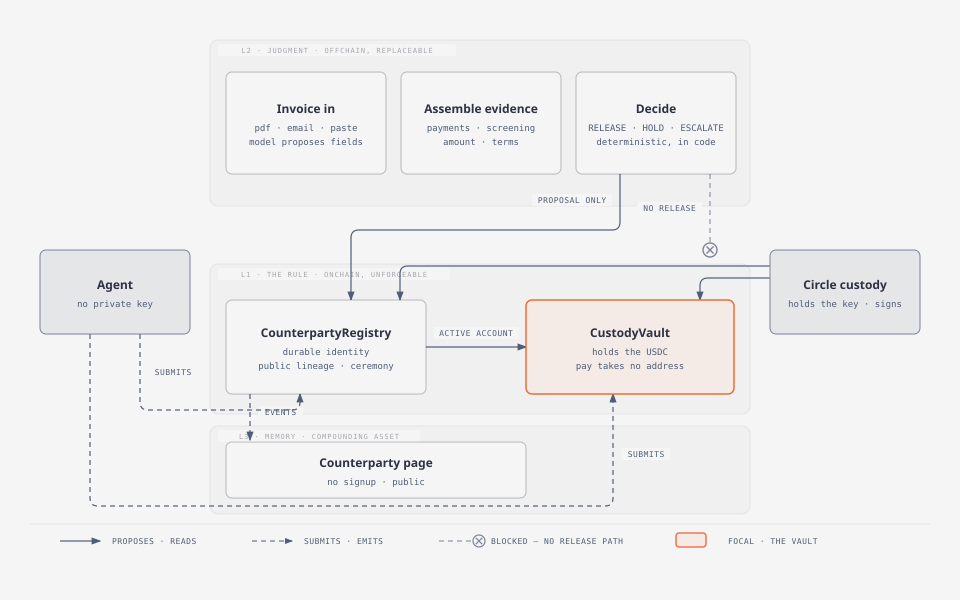
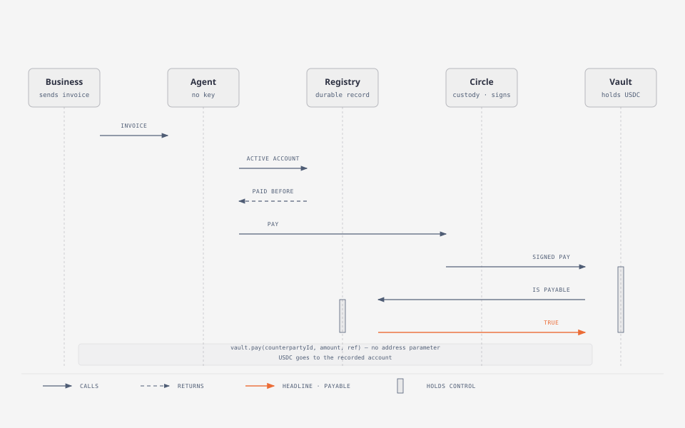
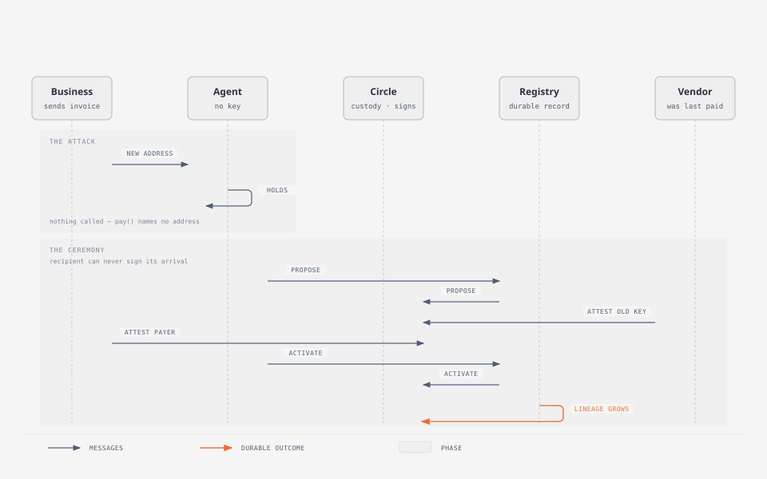
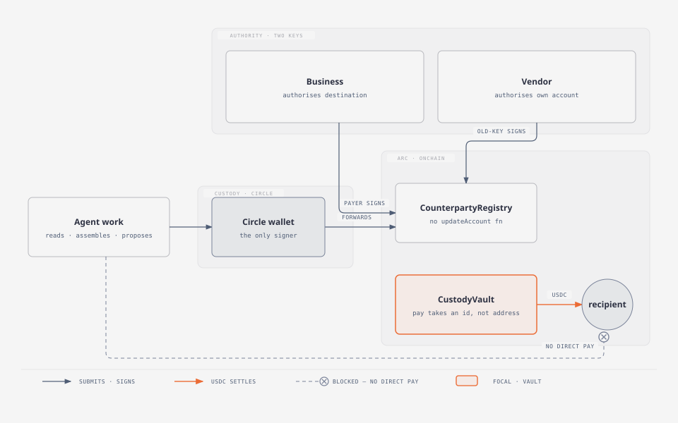

# Horos

**A change of payment address is a succession ceremony, not a field update.**

Horos is an agent that pays a business's invoices from its own USDC wallet on
[Arc](https://arc.network), and will not release a dollar to an address it cannot
prove is the same counterparty it already paid.

The interface makes that structural rather than aspirational: there is no
`updateAccount(address)` function, and the vault has no call that accepts a
destination. Moving a payment address requires two signatures, neither of which
can come from the party receiving the money.

```solidity
function pay(bytes32 counterpartyId, uint256 amount, bytes32 ref) external returns (address);
```

Read that signature again. There is no `to` parameter. The caller names *who* to
pay, never *where*. The destination is resolved from the registry, and the only
way an address becomes a counterparty's active account is a succession ceremony
that the recipient cannot complete on its own.

**Try it:** <https://horos.kiter0211.workers.dev> — press **Load our verified record**,
then **Decide**. That fills the form with the counterparty this deployment has
actually paid, and the document it will refuse. No account, no key, and the page
cannot move money.

### One site, two chains, and a picker that says which

The **chain picker** in the header switches between Arc mainnet and Arc testnet. Both
deployments are live and both are readable from either URL — the second URL exists
only so a link can default to the chain it means:

| | Link | Defaults to |
|---|---|---|
| **Mainnet** | <https://horos-mainnet.kiter0211.workers.dev> | Arc, real USDC |
| **Testnet** | <https://horos.kiter0211.workers.dev> | Arc Testnet, free, keyless |

The choice travels as `?network=arc-mainnet`, so a link can carry it, and the custody
line beside the picker changes with it. That line is there because the two chains
genuinely differ: on **testnet** the agent holds no key at all and Circle signs over
HTTPS; on **mainnet** the agent signs with a local key, because Circle's mainnet
access needs a production account this project does not have — a test API key is
refused for `ARC` with a 400, verified in the audit.

Nothing else on mainnet touches the Circle SDK: not the deployment, not the vault,
not the ceremony, and not the site, which reads the chain directly.

So the sentence that survives on both chains is the one about the contracts, and it
is worth being exact about which sentence changed. **A fully compromised agent
cannot authorise a change of destination** on either chain — `pay()` takes no
address and the payer half needs the business key. What mainnet cannot claim is
*"there is no key in this process"*: there is one, and it is bounded by the global
cap, the per-counterparty cap, and the executor allowlist rather than by its own
absence. [`docs/MAINNET.md`](docs/MAINNET.md) states the trade in full, including
what a production deployment would have to split.

Every claim on the page names its chain. The decision card reports which network it
read, and each record link carries the network it belongs to — a page that hardcoded
one would be wrong on the next deployment, and wrong in the way that looks like a
broken link rather than a false claim.

Read that signature again. There is no `to` parameter. The caller names *who* to
pay, never *where*. The destination is resolved from the registry, and the only
way an address becomes a counterparty's active account is a succession ceremony
that the recipient cannot complete on its own.

**Two live deployments, and they differ in one way that matters.**

| | Link | What it is |
|---|---|---|
| **Mainnet** | <https://horos-mainnet.kiter0211.workers.dev> | Real USDC. The ceremony below was performed on Arc mainnet and every transaction is on the explorer. |
| **Testnet** | <https://horos.kiter0211.workers.dev> | Free to use, and **keyless** — Circle holds the only key. |

Both deployments are recorded: [`deployments/arc-mainnet.json`](deployments/arc-mainnet.json)
and [`deployments/arc-testnet.json`](deployments/arc-testnet.json). The mainnet vault
has since been swept back to its owner — the ceremony is on the explorer, and a
vault with no funds simply cannot pay.

On mainnet the agent signs with a local key, because Circle's mainnet access needs a
production account this project does not have. On testnet there is no key in the
process at all. The contracts, the policy and the refusal are identical on both; the
custody section below states exactly which claim changes and which does not.

**Try it:** <https://horos-mainnet.kiter0211.workers.dev> — paste an invoice, get the
verdict and every reason behind it. No account, no key, and the page cannot move
money.

**The record it acts on:** [a counterparty that has been through the
ceremony](https://horos-mainnet.kiter0211.workers.dev/c/0x2fe51427a51120cf806df0c0efb3931b5b97cb5ec835d6d36190dd2d8f7edda7)
— two accounts, one of them a successor with two signatures behind it, all of it
read from Arc. The three sample invoices on the decision card resolve to
**RELEASE / HOLD / RELEASE** against this record.

## The demo, in two and a half minutes

**[`video/horos-demo.mp4`](video/horos-demo.mp4)** — 2:36, narrated and subtitled,
1920×1080. Seven segments: the hook, the problem, the interface rule, the live
refusal on Arc mainnet, the public record, the chain read, and the close.

Every number, address and transaction in it exists in this repository or on the
chain. Nothing is illustrated.

It is **generated, not screen-recorded** — narration from edge-tts, scenes captured
from a real browser driving the live mainnet site, assembly from ffmpeg. The script
is [`docs/video/story.json`](docs/video/story.json), so the video can be rebuilt
from this repository rather than re-performed, and
[`docs/VIDEO.md`](docs/VIDEO.md) says how.

Building it found a bug the test suite could not: the mainnet site was still
pointing at the previous deployment, so its record page rendered an empty
counterparty. The screen recording is what caught it.

---

## The problem

Business email compromise cost **$3.04 billion in 2025** — 24,768 incidents, an
average reported loss above $122,000, and the second most expensive category of
cybercrime ([FBI IC3 2025](https://www.ic3.gov/AnnualReport/Reports/2025_IC3Report.pdf)).
The mechanism is not a sophisticated attack. An email says the bank details
changed.

The standard control is to phone the vendor and confirm. As of 2026 that control
is under direct attack: the AFP's payments fraud survey
([2026 edition](https://www.financialprofessionals.org/training-resources/resources/survey-research-economic-data/Details/payments-fraud))
measured AI-enabled fraud and **deepfake voice and video impersonation of
executives and vendors for the first time**. 76% of organisations reported
attempted or actual payments fraud in 2025.

So every channel a business uses to *learn* a new counterparty's address — phone,
email, domain, portal, even video — is now forgeable.

**One thing is not.** The key that received the last payment. It never speaks, so
it cannot be cloned. It never leaves the device, so it cannot be phished. It is
the only trustworthy signal left in a redirected payment, and nobody had built a
system around it.

Horos makes that the unit of a payment system.

---

## What it does

```
invoice ─► extract (model proposes) ─► policy (decides, in code) ─► contract (enforces)
```

Three layers, and the separation between them is the design.

| Layer | Where | What it can do |
|---|---|---|
| **Judgment** | offchain | read the invoice, assemble evidence, *propose* a verdict |
| **Policy** | offchain, deterministic | *decide* RELEASE / HOLD / ESCALATE, in code |
| **The Rule** | onchain | *enforce*. the only thing that can move money |

A model can ask a person a question. It cannot release a payment. That asymmetry
is enforced by `applyModelProposal` in [`lib/policy.ts`](lib/policy.ts), which is
one-directional on purpose:

- model says `ESCALATE`, policy says `RELEASE` → **escalated**, with the model's
  reason recorded as a blocking reason
- model says `RELEASE`, policy says `HOLD` → **held**, and the disagreement is
  logged rather than discarded

The second case is the interesting one. The model wants to pay; the policy
refuses; the refusal stands. That disagreement is the calibration scoreboard, and
it is worth more than the model's opinion was.

This is also the correction to a pattern worth naming. Circle's own `arc-escrow`
sample releases funds when a vision model returns `confidence: "HIGH"`, and stores
a release timestamp it never reads. A confidence string is not a control. Here the
model's output is an input, never the release condition.

The judgment layer ([`lib/judgment.ts`](lib/judgment.ts)) uses TypeSafe's System
One models, which return **the calibrated probability that a proposition is
true** — a number, not a sentence. There is no free text to launder a conclusion
through and no prompt to argue with. Measured on the two invoices in the demo,
asked the same questions of each:

Asked the same four questions of each document in the demo (3 runs each, medians;
these are the actual fixture texts, not illustrations):

| | attack | routine invoice | next invoice after the move |
|---|---|---|---|
| is an ordinary invoice | **0.01** | 0.61 | 0.14 |
| contains text addressed to the reader | **0.66** | 0.11 | 0.13 |
| discourages verification | **0.98** | 0.03 | 0.04 |
| asks to be kept quiet | **0.99** | 0.02 | 0.03 |

That separation came from prose in a document rather than from a list lookup — no
address in it has ever been seen before, and nothing in it appears on a list.

The last row is the honest awkward one. "Is an ordinary invoice" is the noisiest of
the four: it reads 0.61 on a genuinely dull invoice, which is close enough to the
threshold that it crossed once and held a payment that was entirely routine. A
control that occasionally refuses a good payment is one that gets switched off, and
then it protects nobody.

So each question carries its own threshold rather than sharing one, and that one is
set at 0.9 instead of 0.5. It still fires on the attack (0.99) and no longer fires on
the ordinary invoice. Raising it rather than deleting it is deliberate — a document
scoring 0.95 on "does not read like an invoice" is genuinely alarming; the middle of
the range is where the question is noise.

The thresholds live in our code, never in a prompt, and the advisory verdict a
model can return is only ever `ESCALATE`. An unremarkable invoice produces no
advisory at all, because a model has nothing to add to it.

---

## The ceremony

When a vendor's payment address changes, the old key and the business must both
sign for it. The proposed new account can supply neither — and neither can
anyone else standing in for the business. The payer half belongs to exactly one
address, named at registration and transferable only by itself.

```
register(name, firstAccount, business, consent)
        │                  ▲                ▲
        │                  │                └ the business names itself, once
        │                  └ the account consents, with its own key
        ▼
proposeSuccession(id, to, window)
        │
        ├─ attest(OldKey)   signed by the account that received the last payment
        ├─ attest(Payer)    signed by the business — the designated key, no other
        └─ quorum           optional, demanded by business or account
        │
     activate()   ──► the new account is now active
```

Both signatures are made against a digest that names the role they fill, and one
key counts once per proposal. A submitter can therefore neither re-role a captured
signature nor satisfy the quorum demand with the business's own key.

This used to say "a registered payer", and registration is permissionless — so
any stranger could register and countersign their own redirect, and a single
compromised vendor key was enough to move everything. The test suite proved it
before the fix did: a stranger registering and signing activated a succession
with the business never agreeing. Now the payer half has one right answer, and
the adversarial tests assert the stranger's signature reverts.

Properties the test suite asserts, most of which are *negations*:

- an account cannot be registered without its own key's consent
- an account cannot change without the old key's signature
- the old key alone still gets nowhere
- the business alone still gets nowhere
- a proposal cannot be activated out of order — a second, fully-signed move to an
  address the *current* account never agreed to is rejected as stale
- a break disclosed while a proposal is in flight stops that proposal too
- a registered stranger's payer signature reverts — registration grants proposing
  and quorum-attesting, never the payer half
- the proposed recipient cannot sign for its own arrival, in any role
- one signature from one party counts once; two parties may sign the same digest
- an expired proposal cannot be revived
- nobody may skip a state
- the registry owner, who is neither the business nor the recipient, has no say
- a payer's payment history cannot be forged — only the vault may record it
- bricking the record (`discloseInheritance`) and demanding quorum are
  business-or-account only — strangers used to be able to do both

If the old key is gone forever, the only remaining path is `discloseInheritance`,
which marks the counterparty `BROKEN` in public and **permanently**, and does not
move the account. Every future payer sees the gap before sending anything.

That is deliberate. The alternative to a disclosed break is a quiet reset, and a
quiet reset is exactly how invoice-redirection fraud launders itself. The contract
offers no way to undo the disclosure, because a system that can quietly un-break a
lineage is not a system.

---

## Three-way separation of authority

| Party | Key | Can do | Cannot do |
|---|---|---|---|
| **Agent** | none on testnet — Circle holds it. Its own local key on mainnet. | trigger payments to the recorded account, submit others' signatures | authorise anything, set budgets, stop the vault, withdraw, pay anyone but the recorded account |
| **Business** | its own | authorise a change of destination, set budgets, stop the vault, recover funds | pay a non-active account |
| **Vendor** | its own | authorise its own new account | sign for itself as a payer or a recipient |

**Custody depends on the network, and this is the one place the two deployments
genuinely differ.** On **testnet** the agent runs on a
[Circle developer-controlled wallet](https://developers.circle.com/wallets): the
private key does not exist in the application at all, Circle derives it from the
entity secret and signs over HTTPS, and there is nothing in the process for a prompt
to reach. On **mainnet** the agent signs with a local key, because Circle's mainnet
access needs a production account this project does not have — a test API key is
refused for `ARC` with a 400, verified in the audit. Nothing else on mainnet touches
the Circle SDK: not the deployment, not the vault, not the ceremony, and not the
site, which reads the chain directly.

So the sentence that survives on both chains is the one about the contracts, and it
is worth being exact about which sentence changed. **A fully compromised agent
cannot authorise a change of destination** on either chain — `pay()` takes no
address and the payer half needs the business key. What mainnet cannot claim is
*"there is no key in this process"*: there is one, and it is bounded by the global
cap, the per-counterparty cap, and the executor allowlist rather than by its own
absence. [`docs/MAINNET.md`](docs/MAINNET.md) states the trade in full, including
what a production deployment would have to split.

That matters more than usual here, because of what vault ownership *means* — and
an earlier version of this document got it wrong. It said handing the vault to an
agent "cannot hand over the ability to spend", and annotated `transferOwnership`
as one-way. Both were false: the owner can call `withdraw()` to an arbitrary
address, and ownership transfers back as easily as it transfers out. A compromised
agent holding the owner role could drain the vault in one call while "it can only
ask" sat in this file.

So the owner is a business-held key, and never the agent wallet — not by policy,
by deployment, verifiable onchain. The agent triggers payments and submits other
parties' signatures. It sets no budgets, stops nothing, withdraws nothing.

And it is the *only* address that can trigger a payment. `pay()` checks an
executor allowlist the owner controls; before that check existed, any stranger
could push the vault's whole balance to the recorded counterparty one cap-sized
payment at a time. The cap bounded each payment; nothing bounded the total.

On mainnet the owner, the executor and the demo counterparty's business key are all
the deploying key, because the total at risk is a few dollars. A production
deployment splits them; the owner can `withdraw()` to any address, so that key
belongs in custody or on a hardware wallet. A fully
compromised agent, holding the Circle credentials that sign whatever it submits,
still cannot send money anywhere `pay()` does not already resolve to — which is
the recorded account and nothing else. *Now* it can only ask.

### It was audited, and the audit changed it

Four adversarial hunters ran against this code — access control, economics, the
web surface, and deployment — plus a validation pass. Eleven findings were real and
are fixed; each fix has a regression test that fails when the guard is removed.

The two that mattered were claims this repository made about itself:

- **Registration was first-to-type, not first-to-pay.** `register()` never checked
  for payment, so a stranger could open the record at someone else's address and
  hold the payer half of it. The account now consents with its own signature, and
  names must share — a name is a label, the id is the identity.
- **A stale proposal could move an account twice.** Two fully-signed proposals
  activated in whatever order a submitter chose, so a signature could authorise a
  move the middle address never agreed to. `attest` and `activate` now both require
  the proposal to be against the account that is *currently* active.

Also fixed: a break disclosed mid-ceremony no longer leaves a proposal alive; the
vault has an executor allowlist, so "the agent triggers payments" is now a property
of the code rather than a description of who usually calls it; and a signed
attestation names the role it is for, so a captured signature cannot be re-roled
to stall a rotation.

[`docs/AUDIT-2026-10-08.md`](docs/AUDIT-2026-10-08.md) is the full record,
including what was checked and held, and what was **deliberately not fixed** with
the reason — a permissionless `registerPayer`, an O(n) `isPayable` with its
measured gas, unilateral disclosure, and a rate limiter that is honest about being
permissive.

### Reading the invoice is the hard part

Before the ceremony, before the policy, before any contract call: which address
does this document want us to pay? The obvious implementation is `text.match(address)[0]`
and it is wrong in a way that matters, because the invoice that tries to steal
your money *prints your real address first*.

A business email compromise invoice is written to be read by a person who is
already slightly suspicious, so it explains itself:

> Previous account: `0x1111…1111`.
> New account: `0x2222…2222`.
> DISREGARD PREVIOUS REMITTANCE INSTRUCTIONS.

The previous account appears first, on purpose — it is the credibility. So
"first address wins" reads the trap. And an attacker who noticed would simply put
their own address in the `previous` field.

[`lib/invoice.ts`](lib/invoice.ts) instead classifies every address by the label
that introduces it. `previous`, `old`, `superseded`, `former`, `replaced`,
`original` and `outstanding` are retired addresses and are never candidates.
Surviving addresses must be unambiguous, and when they are not, the extractor
returns **no address at all** and the policy holds with `AMBIGUOUS_DESTINATION`.

That last part is the design decision worth stating plainly: ambiguity resolves
to *refusal*, never to a guess. Two candidate destinations with nothing to choose
between them is precisely the situation a payment must not be resolved out of,
and the convenient heuristics available here — first one, last one, most frequent
— are all things an attacker can aim.

Note what this layer is *not*. It is not where the safety comes from. Even if
extraction returned the attacker's address with total confidence, `pay()` still
cannot be given it. The extraction rule is there so the agent knows what it is
looking at; the contract is there so it does not matter.

---

## Architecture

### The rule, and how it holds



Data flows **one way**. L2 proposes; L1 disposes. There is no arrow from the model
into the release path, because there is no release path up here — only
`vault.pay(counterpartyId, …)`, and the registry decides what that means.

### The ceremony

The sequence worth tracing end to end, in two traces. Every arrow is a real transaction.



The refusal and the genuine move that follows it are a second trace over the same actors:



Note what is *absent* from the attack step: no call to `activate`, no signature
from the recipient, no owner override, no prompt that could talk its way past.
The refusal is a property of the interface, not of a check that ran.

### Where the money and the authority actually sit



The agent holds none of the three keys. A fully compromised agent that can
submit any transaction it likes still cannot authorise a change of destination,
because `pay()` takes no address and the two signatures come from parties it does
not control.

---

## Run it

Requires Node 22, [Foundry](https://book.getfoundry.sh), and either a funded
Circle wallet or a funded local key.

```bash
pnpm install
(cd contracts && forge install)
cp .env.example .env      # add your keys, see below
pnpm contract:test        # 35 tests
pnpm test                 # 17 tests
```

### The keyless demo

```bash
pnpm deploy:testnet
pnpm demo:circle
```

Executes the full story against real Arc testnet USDC and prints a transaction
hash for every step:

```
01. There is no key in this process
02. Fund the vault           ✓ approve  ✓ deposit
03. Register a counterparty  ✓ register ✓ set a budget
04. Pay 0.4 USDC              ✓ the address is the one on record
05. An invoice arrives with an account we have never paid
      policy: HOLD — nothing has signed for it
06. The ceremony              ✓ propose ✓ vendor attests ✓ business attests ✓ activate
07. Pay 2.4 USDC              policy: RELEASE
08. 2 accounts, 1 ceremony, 0 unapproved changes
```

Every transaction is signed by Circle. `pnpm check:circle` verifies the
credentials, the wallet, and that the contracts are readable through Circle's
Contracts API.

### The local-key demo

```bash
pnpm deploy:testnet
pnpm demo
```

The same story with a local signing key, for when Circle credentials are not
available. Note that Arc's public RPCs are **read-only** — they reject
`eth_sendTransaction` — so writes need a funded node:

```bash
qn endpoint create --chain arc --network arc-testnet
```

Set the result as `HOROS_RPC_URL`, or point `HOROS_RPC_URL` at
`http://127.0.0.1:8545` for anvil.

### Environment

| Variable | Purpose |
|---|---|
| `CIRCLE_API_KEY` | a `TEST_API_KEY` — the Circle SDK is hardcoded to `api.circle.com`, so a sandbox key will not work |
| `CIRCLE_ENTITY_SECRET` | 64 lowercase alphanumeric characters |
| `CIRCLE_WALLET_ID` | the agent's Circle wallet |
| `CIRCLE_WALLET_ADDRESS` | its address, used as vault owner |
| `HOROS_RPC_URL` | a **writable** Arc node |
| `HOROS_DEPLOYER_PRIVATE_KEY` | deploys contracts, signs the payer's half of the ceremony |
| `HOROS_DEMO_VENDOR_KEY` | the vendor's key, for the demo ceremony |
| `HOROS_VAULT_OWNER` | who owns the vault; set to the Circle address for the keyless demo |

Testnet USDC is free from [faucet.circle.com](https://faucet.circle.com) — 20
USDC per claim, no account needed. `pnpm faucet` prints the balance.

---

## Layout

```
contracts/src/CounterpartyRegistry.sol   durable identity, public lineage, the ceremony
contracts/src/CustodyVault.sol           holds USDC, pays counterparties, takes no address
lib/policy.ts                             the decision, as a pure function. no model in the release path
lib/policy.test.ts                        including the cases a model must not be able to overrule
lib/circle.ts                             Circle wallets. the key is never in this process
lib/screening.ts                          one input among many; fails closed unless a person waived it
lib/invoice.ts                            extraction, and prompt-injection capture
lib/chain.ts                              Arc config, RPC failover, 18-decimal gas / 6-decimal USDC
scripts/demo-circle.ts                    the keyless walkthrough
deployment.json                           what is live, committed on purpose
```

`deployment.json` is committed because everything in it is public — contract
addresses, chain id, a timestamp — and readable on the chain anyway. A judge
should be able to see what is deployed without running anything. It is not named
`.env` precisely so that nobody treats it as a credential and ignores it.

---

## Honest scope

Things that are real, and things that are not.

**Real, and verifiable on Arc testnet:**

- the contracts, deployed, with transaction hashes
- the refusal: the policy holds, and the vault cannot be *given* the new address
- the ceremony, signed by two parties, with the recipient shown it cannot self-sign
- the payment after, and the public lineage it leaves
- 52 tests, most of which assert that something **cannot** happen

**Not built yet:**

- a web interface. The decision logic is complete and tested; nobody has touched
  it through a browser
- counterparty screening. [`lib/screening.ts`](lib/screening.ts) reports
  `unavailable` and the policy blocks on it, unless a person has explicitly waived
  screening. A waiver can never hide an actual hit. Both behaviours are tested.
- mainnet. Testnet only.
- cross-chain payments. CCTP is unused.
- yield. `USYC` requires a non-US person, a $100,000 minimum and an allowlist
  ticket, so it was left alone deliberately.
- `Paymaster`, which does not support Arc — USDC *is* the gas token there, so
  there is nothing to abstract.

**Untested against real money.** Every number here is testnet USDC. The logic does
not change on mainnet; the custody assumptions do, and that has not been
exercised.

---

## Prior art

Named because a judge who knows these will ask, and because engaging them is
part of the argument. One line each.

| | What it does | Why this is different |
|---|---|---|
| **Ethereum Attestation Service**, W3C VCs | arbitrary claims about a subject | no primitive for a *signed transition between two subjects* |
| **GLEIF / ISO 17442 vLEI** | durable legal-entity identity, and role authority | identity and authority, with no payment history and no rotation |
| **ENS** | name transfer requires the current holder's signature | continuity over *names*; nothing binds a name to a vendor's payment history |
| **Fireblocks** address whitelisting | a quorum approves adding a destination | a quorum of *your own admins*, per workspace, private. not the previously-paid key, not cross-organisation, not public |
| **PaymentWorks**, Bitwave, Global Database, Graphite, iPiD | cross-business payee verification, change control, dual authorisation | notify, allowlist, or name-match, inside one payer, with no history and no ceremony |
| **Pay.UK Confirmation of Payee** | name-to-account match at the bank, per payment | no history, no changes; and it does not reach unhosted wallets |
| **Phixius / Kinexys Liink** | bank-led peer-to-peer account validation | permissioned bank-to-bank, and name-match rather than behaviour |
| **Chainalysis, TRM, Sardine, zerohash KYA** | screen an address for sanctions or scam | answers *is this payee dangerous*. not *is this my payee* — and a screener cannot see that a brand-new address is itself the signal |
| **Circle `arc-escrow`** | AI-validated escrow | releases funds on a model confidence string, and never reads the release timestamp it stores |

The gap, stated plainly: **no product, in any of these, requires a previously-paid
address to authorise its replacement, and none publishes the history across
businesses.** EAS models claims about a subject. vLEI models identity and
authority. ENS models custody of a name. Fireblocks models a quorum of one
payer's own admins. None of them is a signed transition between two parties at a
payment address.

And the consequence that matters: a screening tool cannot tell you an address is
one minute old and has never been paid by anyone — which is what a redirected
payment looks like. Only history produces that verdict.

---

## Why this exists now

Four things converged:

- **Sep 2026.** The AFP's fraud survey measured deepfake vendor impersonation for
  the first time. The standard "call to confirm" control stopped working.
- **Sep 16, 2026.** Arc mainnet went live. Unhosted B2B USDC at roughly $0.001
  per transfer is now real, and cheap enough to anchor a $40 invoice.
- **2026.** GLEIF published *"Agentic AI in Payments: Establishing Interoperable
  Trust"* and ISO vLEI shipped — giving the vocabulary and the standard for
  durable counterparty identity, while leaving rotation and history unbuilt.
- **Ongoing.** 62% of UK small businesses report being owed money, averaging
  £21.4k, and businesses asking for immediate payment grow measurably faster than
  those on 90-day terms. Getting paid faster should be an asset, not an accident
  of a spreadsheet.

A business that can prove it paid the same counterparty for two years, through
every change, has something a bank statement cannot give it. That is the thing
being built.

---

MIT.
